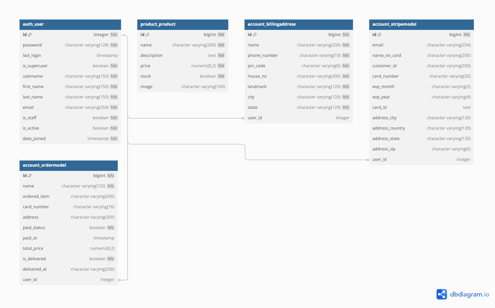

# Deploying Ecommerce Website using Terraform 

## Purpose

In our previous project, we created a custom VPC to separate deployment from production environments. Now, we’re deploying an E-Commerce application on AWS for a new company seeking secure, scalable, and resilient infrastructure. They also want Infrastructure as Code and a CI/CD pipeline to allow updates to both their infrastructure and application as their needs grow.

We’ll use Terraform to build out the AWS resources, including an RDS instance with a PostgreSQL engine to replace our SQLite database. This database will be directly connected to our backend services, allowing improved data handling and scalability. Additionally, we’re separating the frontend from the backend to enhance modularity and performance.

Let's get started!

### Understanding the process
Before automating the deployment of any application, we need to first deploy it "locally" (and manually) to know what the process to set it up is. The following steps 2-11 will guide you to do just that before automating a CICD pipeline.

1. Clone this repo to your GitHub account. IMPORTANT: Make sure that the repository name is "ecommerce_terraform_deployment"

2. Create 2x t3.micro EC2's.  One EC2 is for the "Frontend" and requires ports 22 and 3000 open.  The other EC2 is for the "Backend" and requires ports 22 and 8000 open.

3. In the "Backend" EC2 (Django) clone your source code repository and install `"python3.9", "python3.9-venv", and "python3.9-dev"`

4. Create a python3.9 virtual environment (venv), activate it, and install the dependencies from the "requirements.txt" file.

5. Modify "settings.py" in the "my_project" directory and update "ALLOWED_HOSTS" to include the private IP of the backend EC2.  

6. Start the Django server by running:
```
python manage.py runserver 0.0.0.0:8000
```

7. In the "Frontend" EC2 (React), clone your source code repository and install Node.js and npm by running:
```
curl -fsSL https://deb.nodesource.com/setup_lts.x | sudo -E bash -
sudo apt install -y nodejs
```

8. Update "package.json" and modify the "proxy" field to point to the backend EC2 private IP: `"proxy": "http://BACKEND_PRIVATE_IP:8000"`

9. Install the dependencies by running:
```
npm i
```

10. Set Node.js options for legacy compatibility and start the app:
```
export NODE_OPTIONS=--openssl-legacy-provider
npm start
```

11. You should be able to enter the public IP address:port 3000 of the Frontend server in a web browser to see the application.  If you are able to see the products, it sucessfully connected to the backend server!  To see what the application looks like if it fails to connect: Navigate to the backend server and stop the Django server by pressing ctrl+c.  Then refresh the webpage.  You should see that the request for the data in the backend failed with a status code.

12.  Destroy the 2 EC2's from the above steps. Again, this was to help you understand the inner workings of a new application with a new tech stack.

Our tech stack is React for our front end application, Django for our backend service and for the database we are using SQLite. 

### IaC and a CICD pipeline

1. Create an EC2 t3.medium called "Jenkins_Terraform" for Jenkins and Terraform.
    * [Create an EC2 Instance](https://github.com/kura-labs-org/AWS-EC2-Quick-Start-Guide/blob/main/AWS%20EC2%20Quick%20Start%20Guide.pdf).
    * [Jenkins Install Script](https://github.com/tjwkura5/microblog_VPC_deployment/blob/main/scripts/jenkins_install.sh)
    * [Install Terraform](https://developer.hashicorp.com/terraform/tutorials/aws-get-started/install-cli)
2. Create terraform file(s) for creating the infrastructure. We will be using four modules as outlined below:

    ### VPC ###
    - 1x Custom VPC named "wl5vpc" in us-east-1
    - 2x Availability Zones, we're using us-east-1a and us-east-1b.
    - 2x Public Subnets and 2x Private Subnets. One of each in each AZ.
    - 1x Internet Gateway, 1x NAT Gateways and 1x Elastic IP to assign to my NAT Gateway, one NAT in one     Public Subnet. 
    - 2x Route Tables, 1x Public Route Table for both Public Subnets, 1x Route Table for both private subnets
    - 4x Route Table Associations.
        - 2x for Public Subnets to Public Route Table.
        - 2x for Private Subnets to Private Route Table.
    - 1x VPC Peering Connection between Default VPC and wl5vpc VPC.
    - Resources to call Default VPC resources and assign proper routing and associations where needed for the Default VPC to communicate with Custom VPC.
    - 1x Backend Security Group

    ### EC2 ###
    - 2x Frontend Servers, 1x in each Public Subnet, in each AZ.
    These must be named "ecommerce_frontend_az1" and "ecommerce_frontend_az2" respectively.
    - 1x Frontend Security Group associated to the Frontend servers.
    - 2x Backend Servers, 1x in each Private Subnet, in each AZ.
    These must be named "ecommerce_backend_az1" and "ecommerce_backend_az2" respectively.
    - Associate backend security group created in VPC module to the Backend servers.

    ### RDS ###
    - 1x RDS Postgres DB
    - 1x RDS Subnet Group, associating to the 2 Backend Private Subnets.
    - 1x RDS Security Group, determining what ports are open and which addresses can enter those ports.

    ### ALB ###
    - 1x Application Load Balancer
    - 1x Application Load Balancery Security Group, allowing port 80.
    - 1x Listener on Port 80
    - 1x Target Group for Port 3000
    - 2x Target Group Attachments, 1x for each Frontend Server at port 3000.

3. Create a RDS Module, use the following resource blocks:

```
resource "aws_db_instance" "postgres_db" {
  identifier           = "ecommerce-db"
  engine               = "postgres"
  engine_version       = "14.13"
  instance_class       = var.db_instance_class
  allocated_storage    = 20
  storage_type         = "standard"
  db_name              = var.db_name
  username             = var.db_username
  password             = var.db_password
  parameter_group_name = "default.postgres14"
  skip_final_snapshot  = true

  db_subnet_group_name   = aws_db_subnet_group.rds_subnet_group.name
  vpc_security_group_ids = [aws_security_group.rds_sg.id]

  tags = {
    Name = "Ecommerce Postgres DB"
  }
}

resource "aws_db_subnet_group" "rds_subnet_group" {
  name       = "rds_subnet_group"
  subnet_ids = [aws_subnet.private_subnet.id, aws_subnet.private_subnet_2.id]

  tags = {
    Name = "RDS subnet group"
  }
}

resource "aws_security_group" "rds_sg" {
  name        = "rds_sg"
  description = "Security group for RDS"
  vpc_id      = aws_vpc.ecommerce_vpc.id

  ingress {
    from_port       = 5432
    to_port         = 5432
    protocol        = "tcp"
    security_groups = [aws_security_group.backend_security_group.id]
  }

  egress {
    from_port   = 0
    to_port     = 0
    protocol    = "-1"
    cidr_blocks = ["0.0.0.0/0"]
  }

  tags = {
    Name = "RDS Security Group"
  }
}

output "rds_endpoint" {
  value = aws_db_instance.postgres_db.endpoint
}

```
NOTE: Modify the above resource blocks as needed to fit your main.tf file.

you can either hard code the db_name, username, password or use the varables:

```
variable "db_instance_class" {
  description = "The instance type of the RDS instance"
  default     = "db.t3.micro"
}

variable "db_name" {
  description = "The name of the database to create when the DB instance is created"
  type        = string
  default     = "ecommercedb"
}

variable "db_username" {
  description = "Username for the master DB user"
  type        = string
  default     = "kurac5user"
}

variable "db_password" {
  description = "Password for the master DB user"
  type        = string
}
```

4. Edit the Jenkinsfile with the stages: "Build", "Test", "Init", "Plan", and "Apply" that will build the application, test the application (tests have already been created for this workload- the stage just needs to be edited to activate the venv and paths to the files checked), and then run the Terraform commands to create the infrastructure and deploy the application.

```
pipeline {
  agent any
  stages {
    stage('Build') {
      steps {
        dir('backend') {  // Change to the 'backend' directory
          sh '''#!/bin/bash
          python3.9 -m venv venv
          source venv/bin/activate
          pip install pip --upgrade
          pip install -r requirements.txt
          '''
        }

        dir('frontend') {  // Change to the 'frontend' directory
          sh '''#!/bin/bash
           if ! command -v node &> /dev/null; then
            curl -fsSL https://deb.nodesource.com/setup_lts.x | sudo -E bash -
            sudo apt-get install -y nodejs
           fi

          export NODE_OPTIONS=--openssl-legacy-provider
          export CI=false
          npm ci
          '''
        }
      }
    }
    stage('Test') {
      steps {
        dir('backend') {  // Change to the 'backend' directory
          sh '''#!/bin/bash
          source venv/bin/activate
          export PYTHONPATH=$(pwd)
          pip install pytest-django
          python manage.py makemigrations
          python manage.py migrate
          pytest account/tests.py --verbose --junit-xml test-reports/results.xml
          ''' 
        }
      }
    }
    stage('Init') {
      steps {
        dir('Terraform') {
          sh 'terraform init' 
        }
      }
    } 
    stage('Plan') {
      steps {
        withCredentials([string(credentialsId: 'AWS_ACCESS_KEY', variable: 'aws_access_key'), 
                          string(credentialsId: 'AWS_SECRET_KEY', variable: 'aws_secret_key'),
                          string(credentialsId: 'RDS_PASSWORD', variable: 'db_password')]) {
          dir('Terraform') {
            sh 'terraform plan -out plan.tfplan -var="aws_access_key=${aws_access_key}" -var="aws_secret_key=${aws_secret_key}" -var="db_password=${db_password}"' 
          }
        }
      }     
    }
    stage('Apply') {
      steps {
        dir('Terraform') {
          sh 'terraform apply plan.tfplan' 
        }
      }  
    }       
  }
}

```
5. In order to connect to the RDS database: You will need to first uncomment lines 88-95 of the backend/my_project/settings.py file.  Provide the values for the keys: "NAME"=ecommercedb, "USER"=kurac5user. 

6. Create scripts that will run in "User data" section of each of the instances that will set up the front and/or back end servers when Terraform creates them.  Put these scripts into a "Scripts" directory in the GitHub Repo. [Scripts](https://github.com/tjwkura5/ecommerce_terraform_deployment/tree/main/Terraform/scripts).

There are three scripts in my scripts directory: ecom_backend.sh, ecom_backend_migrations.sh, ecom_frontend.sh. Both my backend scripts do the following:

    * Install node_exporter
    * Installs packages needed for the app 
    * Clones the repository 
    * Creates an activates a virtual environment
    * Installs project dependencies
    * Modifies the Settings.py by adding the RDS_Host, Allowed_Host (Private_IP of the instance), Adding the RDS_password.
    * Serve up the App

The ecom_backend_migrations.sh script does all of the preceding in addition to Loading The Database Into RDS. Its only done one time to ensure there are no duplicate records created:

```
#Create the tables in RDS: 
python manage.py makemigrations account
python manage.py makemigrations payments
python manage.py makemigrations product
python manage.py migrate

#Migrate the data from SQLite file to RDS:
python manage.py dumpdata --database=sqlite --natural-foreign --natural-primary -e contenttypes -e auth.Permission --indent 4 > datadump.json

python manage.py loaddata datadump.json
```
In my ecom_frontend.sh I am doing the following:

    * Downloading and installing Node.js as well as npm
    * Cloning the GitHub repository
    * Replace the placeholder with the private IP of the backend EC2 instance in package.json
    * Install application dependencies
    * Start application

### Running and Creating Jenkins Pipeline

1. Create a multibranch pipeline called "Workload_5" and connect your GitHub account.

2. AFTER adding your GitHub credentials (with or without saving the multibranch pipeline), navigate to the Jenkins Dashboard and click on "Manage Jenkins" on the left navagation panel.

3. Under "Security", click on "Credentials".

4. You should see the GitHub credentials you just created here.  On that same line, click on "System" and them "Global credentials (unrestricted)". (You should see more details about the GitHub credentials here (Name, Kind, Description))

5. Click on "+ Add Credentials"

6. In the "Kind" Dropdown, select "Secret Text"

7. Under "Secret", put your AWS Access Key.

8. Under "ID", put "AWS_ACCESS_KEY" (without the quotes)

9. Repeat steps 5-8 with your secret access key as "AWS_SECRET_KEY".

10. Repeat steps 5-8 with your RDS password as "RDS_PASSWORD". 

    We want to store the sensitive credentials on our jenkins server so that these crednetials are secure and not publicly exposed. 

11. Run the Jenkins Pipeline to create and deploy the infrastructure and application!

**Successful Build**


**Pipeline Graph**


**Ecommerce App**


12. Create a monitoring EC2 called "Monitoring" in the default VPC that will monitor the resources of the various servers. Install Prometheus and grafana on this server.

13. Update your Prometheus configuration (/opt/prometheus/prometheus.yml) to include the EC2 instance where Node Exporter is running.

14. Restart Prometheus to apply the changes:

15. You should now be able to see all of your targets in Prometheus. 

    **Prometheus**


## Issues/Troubleshooting

This workload was a MONSTER. I only got everything working at the last second, and it felt like I was running into issue after issue after issue. To avoid boring you, I will highlight the major problems I faced, as well as some issues I managed to avoid thanks to warnings from a fellow classmate.

**Installing Node and NPM**

When trying to install Node on my frontend servers, I kept running into an issue where Node would get installed, but NPM was not. The funny thing was that it wasn't working in my user data script, but when I SSH'd into my instance after it was created, I was able to install everything just fine. I tried everything, and no one else seemed to have the same issue as me. I attempted to use an alternate method to install Node/NPM, tried installing NPM separately, added a line to reinstall NPM, and included a check to see if npm was available in the current path with logic to add npm to the PATH variable if it wasn't. I ultimately solved the issue during office hours with my instructors. It turns out the installation was taking a long time, and all I needed was a 60-second sleep. From there, everything worked fine.

**Running the Test***

The test stage of my Jenkins pipeline was failing because it was attempting to run tests against a database that didn't exist yet. I didn't want to comment out the default database section of my settings.py, and I didn't want to provision my RDS instance prematurely. The solution was simple: I created a separate settings.py for my tests, keeping everything the same except for changing the default database to the SQLite database. In my pytest.ini, I set the DJANGO_SETTINGS_MODULE to my_project.settings_test. 

**Running the Migrations**

This issue is embarrassing. In my defense, the Node/NPM installation problem was definitely a fluke, but I digress. I encountered an issue where my migrations were not running. I tried to run them with my user data script and also attempted to run them manually. I was facing errors indicating either "CommandError: Unable to serialize database: no such table: auth_group" or that my datadump.json file was empty or too small. At the last minute, I finally noticed what was going on: I had accidentally added db.sqlite3 to my .gitignore! When I checked in my db.sqlite3 file, my migrations worked just fine.

Additionally, during a study session with my fellow classmates, two of them encountered the issue "psycopg2.errors.StringDataRightTruncation: value too long for type character varying(16)." The solution was to modify the models.py file in backend/accounts. The Stripe model for the credit card value was set to 16 characters, but increasing it to 20 fixed the issue. 


**Configuring The Load Balancer**

One of my fellow classmates was experiencing an issue where the load balancer wasn't able to direct traffic to the frontend servers. The solution was to add {"start": "DANGEROUSLY_DISABLE_HOST_CHECK=true HOST=0.0.0.0 PORT=3000 react-scripts start"} to the package.json. By default, React applications created with Create React App perform a host check to prevent unauthorized access. If the host is not on the allowed list, the application may reject the connection. Setting DANGEROUSLY_DISABLE_HOST_CHECK=true disables this safety feature, allowing the application to accept requests from any host.

However, disabling the host check poses a safety issue because it removes a layer of protection against certain types of attacks. A potential optimization would be to specify the allowed host from the load balancer configuration.


## System Diagram


## Business Intelligence

The database for this application is not empty.  There are many tables but the following are the ones to focus on: "auth_user", "product", "account_billing_address", "account_stripemodel", and "account_ordermodel"

For each of the following questions (besides #1), you will need to perform SQL queries on the RDS database. From the command line, install postgresql so that you can use the psql command to connect to the db with `psql -h <RDS-endpoint> -U <username> -d <database>`. Then run SQL queries like normal from the command line.

Questions: 

1. Create a diagram of the schema and relationship between the tables (keys).

    **Entity Relationship Diagram**

    

2. How many rows of data are there in these tables?  What is the SQL query you would use to find out how many users, products, and orders there are?

    ```
    SELECT COUNT(*) FROM public.product_product; = 33
    SELECT COUNT(*) FROM public.auth_user; = 3003 
    SELECT COUNT(*) FROM public.account_ordermodel;  = 15005
    ```

3. Which states ordered the most products? Least products? Provide the top 5 and bottom 5 states.

    ```
    SELECT s.address_state, COUNT(o.id) AS order_count
    FROM account_ordermodel o
    JOIN account_stripemodel s ON o.user_id = s.user_id
    GROUP BY s.address_state
    ORDER BY order_count DESC
    LIMIT 5;

    address_state | order_count 
    ---------------+-------------
    Alaska        	  |         390
    Ohio          	  |         386
    Montana       	  |         381
    Alabama       	  |         375
    Texas         	  |         366

    **** Made a mistake here its actually the last query ****
    SELECT s.address_state, COUNT(o.id) AS order_count
    FROM account_ordermodel o
    JOIN account_stripemodel s ON o.user_id = s.user_id
    GROUP BY s.address_state
    ORDER BY order_count ASC
    LIMIT 5;

    address_state | order_count 
    ---------------+-------------
    BLANK              |           8
    Delhi         	   |          16
    Maine              |         224
    Nevada        	   |         226
    Florida            |         229

    ***** Got this Correction from a classmate *****
    SELECT state, count(*) AS count
    FROM account_ordermodel AS aom
    INNER JOIN account_billingaddress AS aba ON aom.user_id = aba.user_id
    GROUP BY state
    ORDER BY count ASC
    LIMIT 5;

    state   | count 
    ----------+-------
    ny       |     1
    Blank    |     8
    Delhi    |    16
    new york |    16
    Maine    |   224
    ```

4. Of all of the orders placed, which product was the most sold? Please prodide the top 3.

    ```
    SELECT ordered_item, COUNT(*) AS order_count 
    FROM account_ordermodel 
    GROUP BY ordered_item 
    ORDER BY order_count DESC LIMIT 3;

            ordered_item                              					  | order_count 
    -----------------------------------------------------------------------+-------------
    Logitech G305 Lightspeed Wireless Gaming Mouse (Various Colors)       |         502
    2TB Samsung 980 PRO M.2 PCIe Gen 4 x4 NVMe Internal Solid State Drive |         489
    Arcade1up Marvel vs Capcom Head-to-Head Arcade Table                  |         486
    ```

## Understanding Our Load Balancer Configuration


### 1. **Security Group for the Load Balancer**
```hcl
resource "aws_security_group" "lb_sg" {
  name        = "lb_sg"
  vpc_id     = var.vpc_id
  ingress {
    from_port   = 80
    to_port     = 80
    protocol    = "tcp"
    cidr_blocks  = ["0.0.0.0/0"]  # Allow HTTP traffic from anywhere
  }

  egress {
    from_port   = 0
    to_port     = 0
    protocol    = "-1"
    cidr_blocks = ["0.0.0.0/0"]  # Allow all outbound traffic
  }
}
```
- **Purpose**: The security group (`lb_sg`) allows inbound HTTP traffic on port 80 from any IP address (0.0.0.0/0), making the load balancer publicly accessible. It also allows all outbound traffic.
- **Ingress Rules**: The ingress rule permits HTTP requests, enabling clients from anywhere to access your application through the load balancer.
- **Egress Rules**: By allowing all outbound traffic, the load balancer can communicate with the registered targets (EC2 instances) and other AWS services.

### 2. **Target Group for the Load Balancer**
```hcl
resource "aws_lb_target_group" "my_target_group" {
  name     = "my-target-group"
  port     = 3000
  protocol = "HTTP"
  vpc_id   = var.vpc_id

  health_check {
    path                = "/"
    interval            = 30
    timeout             = 5
    healthy_threshold  = 2
    unhealthy_threshold = 2
  }
}
```
- **Purpose**: The target group (`my_target_group`) defines how the load balancer routes requests to the registered targets, in this case, EC2 instances running a service on port 3000.
- **Health Checks**: The configuration specifies a health check that pings the root path ("/") of the instances every 30 seconds. If two consecutive health checks return success (healthy threshold), the instance is marked as healthy; if two fail (unhealthy threshold), it is marked unhealthy and temporarily removed from receiving traffic.

### 3. **Load Balancer**
```hcl
resource "aws_lb" "my_lb" {
  name               = "my-load-balancer"
  internal           = false
  load_balancer_type = "application"
  security_groups    = [aws_security_group.lb_sg.id]

  enable_deletion_protection = false

  subnets = [
    var.public_subnet_id_1,  
    var.public_subnet_id_2   
  ]
}
```
- **Purpose**: The load balancer (`my_lb`) distributes incoming HTTP traffic across multiple targets (EC2 instances) based on the configurations defined in the target group.
- **Type**: It is an Application Load Balancer (ALB), suitable for HTTP/HTTPS traffic and capable of performing advanced routing decisions.
- **Public Accessibility**: By setting `internal` to `false`, the load balancer is configured to be accessible from the internet.
- **Subnets**: The load balancer is placed in public subnets (specified by `var.public_subnet_id_1` and `var.public_subnet_id_2`), allowing it to receive traffic directly from users.

### 4. **Listener for Load Balancer**
```hcl
resource "aws_lb_listener" "http_listener" {
  load_balancer_arn = aws_lb.my_lb.arn
  port              = 80
  protocol          = "HTTP"

  default_action {
    type             = "forward"
    target_group_arn = aws_lb_target_group.my_target_group.arn
  }
}
```
- **Purpose**: The listener (`http_listener`) listens for incoming HTTP requests on port 80 and forwards them to the target group defined earlier.
- **Default Action**: When a request is received, it is forwarded to the target group, where the load balancer selects a healthy instance based on its load balancing algorithm.

### 5. **Register EC2 Instances to the Target Group**
```hcl
resource "aws_lb_target_group_attachment" "instance1" {
  target_group_arn = aws_lb_target_group.my_target_group.arn
  target_id        = var.instance_id_1
  port             = 3000
}

resource "aws_lb_target_group_attachment" "instance2" {
  target_group_arn = aws_lb_target_group.my_target_group.arn
  target_id        = var.instance_id_2
  port             = 3000
}
```
- **Purpose**: These resources (`instance1` and `instance2`) attach EC2 instances (specified by `var.instance_id_1` and `var.instance_id_2`) to the target group, allowing the load balancer to route requests to them.
- **Port**: The instances listen on port 3000, which matches the configuration in the target group, ensuring traffic can be correctly forwarded to the application running on these instances.

### **Overall Workflow of the Load Balancer**
1. **Client Request**: When a client makes an HTTP request to the load balancer's public IP on port 80, the request is accepted by the listener.
2. **Routing**: The listener forwards the request to one of the registered targets (EC2 instances) in the target group.
3. **Health Checks**: The load balancer continuously checks the health of the instances in the target group using the specified health check configuration. If an instance becomes unhealthy, it stops forwarding requests to that instance until it recovers.
4. **Response**: The selected EC2 instance processes the request and sends the response back through the load balancer to the client.

This configuration allows you to efficiently manage traffic to your application while ensuring high availability and fault tolerance by distributing requests across multiple instances and monitoring their health.

## Understanding Our RDS Instance Configuration

### 1. **RDS Instance Configuration**
```hcl
resource "aws_db_instance" "postgres_db" {
  identifier           = "ecommerce-db"
  engine               = "postgres"
  engine_version       = "14.13"
  instance_class       = var.db_instance_class
  allocated_storage    = 20
  storage_type         = "standard"
  db_name              = var.db_name
  username             = var.db_username
  password             = var.db_password
  parameter_group_name = "default.postgres14"
  skip_final_snapshot  = true

  db_subnet_group_name   = aws_db_subnet_group.rds_subnet_group.name
  vpc_security_group_ids = [aws_security_group.rds_sg.id]

  tags = {
    Name = "Ecommerce Postgres DB"
  }
}
```
- **Purpose**: This resource defines the PostgreSQL database instance (`postgres_db`) in RDS.
- **Properties**:
  - `identifier`: A unique identifier for your database.
  - `engine`: Specifies that the database engine is PostgreSQL.
  - `engine_version`: Specifies the version of PostgreSQL being used.
  - `instance_class`: Refers to the instance type (e.g., `db.t2.micro`) specified in `var.db_instance_class`.
  - `allocated_storage`: Sets the storage size in gigabytes (20 GB in this case).
  - `storage_type`: Specifies the storage type (standard in this case).
  - `db_name`, `username`, `password`: These variables define the initial database name, username, and password for connecting to the database.
  - `parameter_group_name`: Indicates which parameter group to use for database configuration.
  - `skip_final_snapshot`: If set to `true`, the final snapshot of the database will not be taken when the database instance is deleted. 

### 2. **RDS Subnet Group**
```hcl
resource "aws_db_subnet_group" "rds_subnet_group" {
  name       = "rds_subnet_group"
  subnet_ids = [var.private_subnet_id, var.private_subnet_id_2]

  tags = {
    Name = "RDS subnet group"
  }
}
```
- **Purpose**: The subnet group (`rds_subnet_group`) defines which subnets your RDS instance can reside in.
- **Subnets**: The database instance will live in the private subnets defined by `var.private_subnet_id` and `var.private_subnet_id_2`.
  - **Private Subnets**: These are subnets that do not have a route to the Internet Gateway, making them suitable for hosting databases that should not be directly accessible from the internet. It is a good practice to place RDS instances in private subnets to enhance security.

### 3. **Security Group for RDS**
```hcl
resource "aws_security_group" "rds_sg" {
  name        = "rds_sg"
  description = "Security group for RDS"
  vpc_id      = var.vpc_id

  ingress {
    from_port       = 5432
    to_port         = 5432
    protocol        = "tcp"
    security_groups = [var.backend_security_group_id]
  }

  egress {
    from_port   = 0
    to_port     = 0
    protocol    = "-1"
    cidr_blocks = ["0.0.0.0/0"]
  }

  tags = {
    Name = "RDS Security Group"
  }
}
```
- **Purpose**: This security group (`rds_sg`) controls access to the RDS instance.
- **Ingress Rule**: The configuration allows incoming traffic on port 5432 (the default port for PostgreSQL) from the instances that belong to the security group specified by `var.backend_security_group_id`. This means only your backend services that are part of this security group can connect to the database.
- **Egress Rule**: Similar to the load balancer's security group, the egress rule permits all outbound traffic.

### 4. **Outputs**
```hcl
output "rds_endpoint" {
  value = aws_db_instance.postgres_db.address
}

output "db_password" {
  value = var.db_password
}
```
- **Purpose**: These outputs provide useful information after the resources are created.
  - **RDS Endpoint**: The first output gives the endpoint address of the RDS instance, which you will use to connect to the database.
  - **Database Password**: The second output provides the password for connecting to the database (useful for your application).

### **Summary**
- Your RDS instance (`postgres_db`) lives in the subnets specified in the `aws_db_subnet_group` resource, which are defined by `var.private_subnet_id` and `var.private_subnet_id_2`. Since these are private subnets, the RDS instance is not directly accessible from the internet, which enhances security.
- The security group (`rds_sg`) allows only traffic from specific sources, typically your application servers or backend services, to connect to the RDS instance.

Not exactly random, but rather based on the Availability Zone (AZ) and resource availability. Here’s a more detailed explanation:

1. **Subnet Group**: When you create a database subnet group with multiple subnets (like `private_subnet_id` and `private_subnet_id_2`), AWS uses this group to manage where to place your RDS instance. Each subnet in the group must be in a different Availability Zone.

2. **Availability Zone Selection**: When you launch an RDS instance:
   - AWS selects one of the subnets from the subnet group that has available resources in one of the associated Availability Zones.
   - It does not choose randomly; rather, it considers the health of the subnets, resource availability, and any configured Multi-AZ options.
  
3. **Multi-AZ Deployment**: 
   - If you enable Multi-AZ deployment, AWS will automatically create a standby instance in a different AZ for high availability. In this case, the RDS instance will be in one subnet, and the standby instance will be in the other subnet specified in the subnet group.

### Summary
The selection of the subnet for the RDS instance is based on the availability and health of the subnets rather than random selection. AWS aims to optimize the placement for reliability and availability while adhering to the specified constraints in your subnet group.

## Optimization

**Our Database Configuration** - Right now our database lives in the same private subnet with our backend service. Moving the RDS instance to its own subnet would enhance security, simplifies network access control, and can improve scalability. Additionally, we can also set the Multi-AZ flag in our terraform configuration to replicate our database in multiple availability zones within a region This set up would ensure redundancy, high availability and failover support.  

**OWASP SCAN** - In our previous workload we are performing An OWASP Dependency-Check to proactively scan for vulnerabilities in the application’s dependencies. In this workload we didn't inlcude this stage in our pipeline. I did some digging and I saw that OWASP tools like ZAP (Zed Attack Proxy) can scan Django apps to identify vulnerabilities such as SQL injection, cross-site scripting (XSS), and improper authentication handling.

**Testing Our Frontend** - We included a stage for running tests for our backend services but we don't have any unit test for our frontend application. We should incorporate unit test to catch bugs eary and ensure the components our behaving as expected in our react app. 

**Adding Tear Down** - If we want to be able to run our CI/CD pipeline repeatedly, we should add a teardown stage to destroy and rebuild our infrastructure. This will make our process more flexible and reliable by ensuring that every deployment is from a clean slate, reducing the chance of configuration drift and persistent errors. It also allows us to validate our Infrastructure as Code (IaC) fully, confirming that the environment can be consistently recreated with each run.

**Separate Repos** - Our Repos for our terraform code, frontend code, and backend code should be developed, tested, and maintained independently for modularity. This would ensure:

* Different teams can specialize in their respective areas.
* Changes in one codebase won't inadvertently impact another.
* Easier collaboration
* Better secruity due to different access controls
* Clear History and Change Tracking

This might require different CI/CD pipelines for each repo with a master pipeline that hooks into the child pipelines. 

**Scalability** - Implementing autoscaling policies for backend EC2 instances to dynamically adjust compute resources based on traffic or load.

## Conclusion 

In conclusion, our project successfully established a robust and scalable infrastructure for our E-Commerce application on AWS. By leveraging Terraform to implement Infrastructure as Code (IaC), we enable faster deployment through automated provisioning, enhanced scalability to seamlessly handle varying workloads, and improved efficiency and consistency across our infrastructure. The transition from an SQLite database to a PostgreSQL RDS instance is a significant improvement, enabling better data management and scalability.

We provisioned various AWS resources, including a custom VPC, EC2 instances for frontend and backend services, and an Application Load Balancer. The use of modules within Terraform has streamlined the deployment process, allowing for clear separation and reusability of our infrastructure components.

We addressed several challenges during the development process, including issues with Node.js and NPM installation, database migrations, and test executions. Each obstacle provided valuable learning experiences, leading to solutions that strengthened our deployment scripts and practices.

Overall, this project not only meets the initial objectives set forth by the company but also lays a solid foundation for future enhancements. As the company continues to expand, this infrastructure will adapt to evolving needs, ensuring that the E-Commerce application remains resilient and efficient. Moving forward, we are well-positioned to integrate additional features and improvements, reflecting the ongoing commitment to quality and performance in our cloud infrastructure.